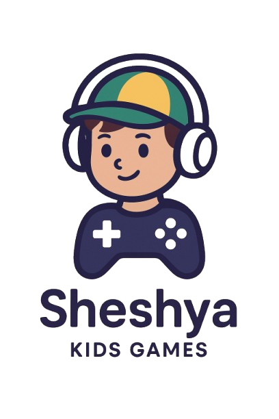

# 🎮 Sheshya - Interactive Educational Game

  

## 📝 Overview

Sheshya is a cutting-edge educational game application crafted with Flutter, designed to transform learning into an exciting adventure for children aged 2-20 years. Through interactive games and engaging content, we make education fun and memorable!

## ✨ Key Features

### 🎯 Age-Specific Learning
- 👶 Ages 2-4: Basic shapes, colors, and simple objects
- 🧒 Ages 5-7: Everyday objects, professions, and tools
- 🧑 Ages 8-20: Advanced concepts, science, and technology

### 🎲 Interactive Game Modes

#### 🖼️ Image Matching Game
- Visual recognition skills development
- Progressive difficulty levels
- Real-time feedback and scoring

#### 🎵 Audio Recognition Game
- Sound-based learning exercises
- Voice guidance and pronunciation
- Musical elements for engagement

#### 📝 Sentence Formation Game
- Grammar and syntax learning
- Drag-and-drop word arrangement
- Context-based sentence building

#### ❓ Fill-in-the-blanks Game
- Vocabulary enhancement
- Context understanding
- Instant feedback system

## 🚀 Getting Started

### Prerequisites

- 📱 Flutter SDK (>=3.7.0)
- ⚙️ Dart SDK (>=3.0.0)
- 💻 Android Studio / VS Code

### 🛠️ Installation

1. Clone the repository:
\`\`\`bash
git clone https://github.com/yourusername/sheshya.git
\`\`\`

2. Navigate to project:
\`\`\`bash
cd sheshya
\`\`\`

3. Install dependencies:
\`\`\`bash
flutter pub get
\`\`\`

4. Run the app:
\`\`\`bash
flutter run
\`\`\`

## 📁 Project Structure

\`\`\`
lib/
├── 📱 main.dart                  # App entry point
├── 🎮 game_selection_page.dart   # Game mode selection
├── 🖼️ image_match_game_page.dart # Image matching game
├── 🎵 audio_game_page.dart       # Audio recognition game
├── 📝 sentence_game_page.dart    # Sentence formation game
├── ❓ fill_game_page.dart        # Fill in the blanks game
├── 👤 profile_page.dart         # User profile & progress
└── 📊 game_models.dart          # Data models
\`\`\`

## 📦 Assets Organization

\`\`\`
assets/
├── 🖼️ age 2 - 4/               # Basic learning images
├── 🖼️ age 5 - 7/               # Intermediate content
├── 🖼️ age 8 - 20/              # Advanced learning materials
├── 🎵 audio/                    # Sound files
└── 📊 game_data/               # JSON data files
\`\`\`

## 🔧 Dependencies

- 💫 \`flutter_native_splash\`: Beautiful splash screen
- 🎵 \`just_audio\`: Smooth audio playback
- More in \`pubspec.yaml\`

---

Made with ❤️ by Akash

